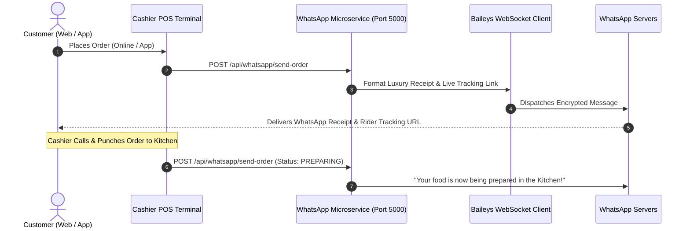

# 🍲 Haandi by Yumto — WhatsApp Bot Automation Setup & Architecture Guide

This document provides complete, production-grade documentation for the **Self-Hosted Free WhatsApp Order Notification & Live Tracking Bot** built for Haandi by Yumto.

---

## 📌 1. System Overview

The WhatsApp Bot service is a standalone Node.js microservice running on the restaurant's Cashier POS system or a cloud server. It uses `@whiskeysockets/baileys` to connect directly to WhatsApp's multi-device WebSocket servers.

### Key Benefits:
- **100% Free Forever:** Zero monthly subscription fees, zero per-message charges.
- **Direct Multi-Device Pairing:** Pair once using a QR code on the restaurant's phone; session persists across server restarts.
- **Automated Triggering:** Dispatches instant luxury receipts with live tracking links upon order creation and kitchen preparation status updates.
- **Fallback Support:** Generates direct `wa.me/` links if the background bot service is ever offline.

---

## 🏗️ 2. Architecture & Workflow



---

## ⚙️ 3. Quick Start & Setup

### Prerequisites
- Node.js (v18.0.0 or higher)
- Active WhatsApp on any phone number (e.g., restaurant SIM)

### Step 1: Start the Service
In the root directory of the project, execute:
```bash
npm run whatsapp:bot
```

### Step 2: Scan QR Code
1. The terminal will generate an ASCII QR Code.
2. Simultaneously, on the **Cashier POS** or **Manager Dashboard**, click the **"WhatsApp Bot"** green button in the top navigation bar.
3. The live QR Code will be rendered on screen.
4. On the restaurant phone, open **WhatsApp** → Tap **Menu (⋮)** / **Settings** → **Linked Devices** → **Link a Device** → Scan the QR Code.

### Step 3: Persistent Authentication
Once linked, session credentials are saved automatically to `server/auth_info_baileys/`. Subsequent server restarts will automatically reconnect without needing to scan again.

---

## 📡 4. REST API Reference

The microservice runs locally at `http://localhost:5000` (or the configured `PORT` environment variable).

### 1. `GET /api/whatsapp/status`
Returns the current connection state and active QR code Data URL if awaiting authorization.

**Response:**
```json
{
  "success": true,
  "status": "connected",
  "isReady": true,
  "phoneNumber": "923001234567",
  "lastUpdated": "2026-09-04T18:00:00.000Z"
}
```

### 2. `POST /api/whatsapp/send-order`
Dispatches a formatted luxury order receipt with item breakdown, 5% service charge, FBR GST, and live tracking link.

**Request Body:**
```json
{
  "orderId": "HD-8492",
  "customerName": "Muhammad Ali",
  "customerPhone": "03001234567",
  "items": [
    { "name": "Special Mutton Handi (Half)", "quantity": 1, "price": 2400 },
    { "name": "Roghani Naan", "quantity": 2, "price": 120 }
  ],
  "total": 2814,
  "orderType": "DELIVERY",
  "deliveryAddress": "House 4, Street 12, Executive Block, Gulberg Greens",
  "trackingUrl": "https://haandibyyumto.com/track?id=HD-8492",
  "discountAmount": 0
}
```

**Response:**
```json
{
  "success": true,
  "messageId": "BAE59F89...",
  "recipient": "923001234567@s.whatsapp.net",
  "sentAt": "2026-09-04T18:01:23.000Z"
}
```

### 3. `POST /api/whatsapp/send-custom`
Sends custom text messages (e.g. promotional updates or payment reminders).

**Request Body:**
```json
{
  "phone": "03001234567",
  "message": "Assalam-o-Alaikum! Your table reservation at Haandi by Yumto has been confirmed."
}
```

### 4. `POST /api/whatsapp/logout`
Unlinks the current session and clears authorization credentials.

---

## 🚀 5. Production Deployment Guide (PM2 / Windows Service)

### Option A: Using PM2 (Recommended)
To keep the bot running 24/7 in the background with auto-restart on system crashes or reboots:

```bash
# Install PM2 globally
npm install -g pm2

# Start the WhatsApp bot under PM2
pm2 start server/whatsapp-server.js --name "haandi-whatsapp-bot"

# Save PM2 process list for auto-boot
pm2 save
pm2 startup
```

### Option B: Windows Background Service
To run as a Windows Service automatically on Cashier POS boot:
```powershell
npm install -g node-windows
```

---

## 🔒 6. Troubleshooting & Best Practices

1. **Number Formatting:** The engine automatically standardizes all Pakistani phone numbers (e.g. `03001234567` $\rightarrow$ `923001234567@s.whatsapp.net`).
2. **Re-Authentication:** If the session is logged out from the phone's Linked Devices list, open the **WhatsApp Bot Modal** on the Cashier POS, click **Unlink / Reset**, and scan the new QR Code.
3. **Firewall:** Ensure port `5000` is open on localhost for internal frontend communication.
